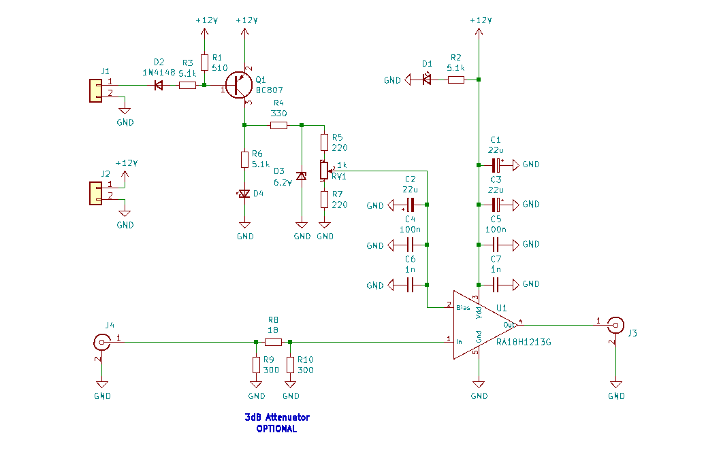
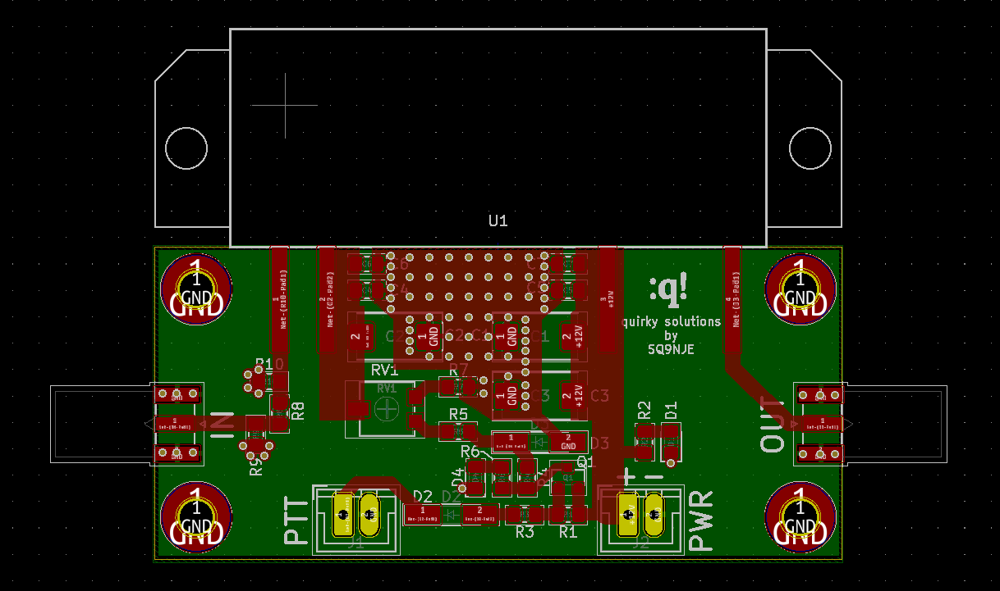

# Power Amplifier for the 23cm Band
This is a simple power amplifier for the 23cm HAM band. It uses the 18W RA18H1213G module from Mitsubishi as the active device.

## Interactive BOM
Interactive BOM is available [here](https://htmlpreview.github.io/?https://github.com/sq9nje/23cm_PA/blob/master/bom/ibom.html)